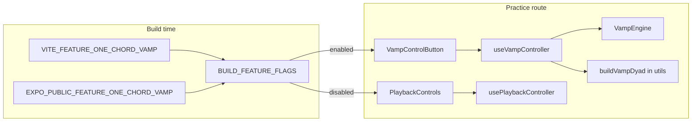

# ModeWise One-Chord Vamp — Implementation Tasks

**Document type:** Feature implementation plan (executable task list)  
**Feature:** One-chord root + fifth vamp drone for Practice Mode  
**Specification:** [`modewise_one_chord_vamp_functional_technical_spec.md`](./modewise_one_chord_vamp_functional_technical_spec.md)  
**Status:** Not started  
**Last updated:** 2026-06-22  
**Implementation status:** Phases 0–5 complete; Phase 6 partial (CI green with flag off; production enablement pending)

---

## 1. Purpose

This document breaks the One-Chord Vamp specification into small, atomic, checkbox-tracked tasks for web and mobile delivery. It maps requirements onto the current FretSensei monorepo, preserves existing practice-route behaviour when the feature is **disabled**, and introduces a **build-time feature-flag** system so the vamp can ship in code without being exposed in production.

**Primary outcome:** When enabled at build time, `/practice` replaces note-sequence playback controls with a single **Start Vamp / Stop Vamp** toggle that drones root + perfect fifth for the selected key. When disabled (production default), practice behaves exactly as today.

---

## 2. Spec Review Summary

The combined functional/technical spec is **implementation-ready**. Key strengths:

- Clear musical definition (root + perfect fifth only; mode-independent)
- Explicit mutual exclusion with sequence playback (FR-VAMP-008)
- Shared domain + platform audio engine split (§10.1–10.10)
- Reducer/state model, engine interface, UI component sketches, and test matrix already defined
- Non-goals and future Plus/Pro layering called out (§4, §18)

### Gaps / decisions to resolve during delivery

| Topic | Spec | Current codebase | Decision for implementation |
|---|---|---|---|
| Practice vs Visualiser mode | FR-VAMP-001 distinguishes two modes with different playback UIs | Only `/practice` route exists; sequence playback lives on practice toolbar | Map **Practice Mode** → `/practice`. When `oneChordVamp` flag is **on**, hide sequence controls and show vamp. When **off** (prod), keep current sequence UI. No separate Visualiser route in this release. |
| `activePracticeTool` state | `'sequence' \| 'vamp'` in state | Not present | Add `vampPlaybackState` to shared reducer always (domain testable). UI tool selection driven by **build flag**, not a user toggle, in v1. |
| Feature gating | FR-VAMP-012 capability-gated | No feature-flag module | **Build-time flags** (§5 below). Production defaults **off**. Domain + engines compile in all builds; UI/audio wiring gated. |
| Selected key VM | `buildVampDyad(selectedKey)` | `SelectedKeyViewModel` exists on fretboard view model | Derive dyad from `getSelectedKey()` + existing display label helpers; reuse sharp internal roots + flat display labels. |
| Web audio | Sustained oscillators (not Karplus) | Karplus sequence engine in `apps/web/src/playback/` | New `VampEngine` alongside existing `PlaybackEngine`; do not extend Karplus buffers for infinite drone. |
| Mobile native | `react-native-audio-api` oscillators | Karplus via `web-audio-engine.ts` pattern | Mirror web oscillator chain in mobile vamp engine. |
| Mobile Expo Go / sample | Hide or graceful message | `EXPO_PUBLIC_PLAYBACK_ENGINE=sample` → `expo-av` | When vamp flag on **and** sample engine active: hide vamp button or show FR-VAMP-011-style unsupported message (prefer hide in prod builds). |
| Stop on leave practice | FR-VAMP-005, §10.6 | `navigateHomeFromPractice()` stops sequence playback + portrait | Extend home navigation and practice unmount to call `stopVamp` + engine dispose. |
| Analytics | §11 optional events | Web `trackEvent` env-gated | Add events only when analytics enabled; include `featureFlag: oneChordVamp` in properties. |
| Monetisation UI | Plus tier suggested later | No entitlements | **No paywall UI** in this release. Flag only; entitlement hook stub in `packages/utils` for future Plus gate. |

---

## 3. Current Baseline (Codebase)

| Area | Location | Notes |
|---|---|---|
| Practice route (web) | `apps/web/src/screens/PracticeScreen.tsx` | Owns visualiser state + `usePlaybackController` |
| Practice route (mobile) | `apps/mobile/app/practice.tsx` | Same; `usePracticeOrientation` for landscape |
| Playback UI (web) | `apps/web/src/components/FretFocusPanel.tsx`, `PlaybackControls.tsx` | Play/Stop/BPM/subdivision/repeat |
| Playback UI (mobile) | `apps/mobile/src/components/MobileToolbar.tsx`, `PlaybackControls.tsx` | Compact toolbar row |
| Sequence engine (web) | `apps/web/src/playback/web-audio-engine.ts` | Karplus-strong sequence |
| Sequence engine (mobile) | `apps/mobile/src/playback/web-audio-engine.ts`, `create-playback-engine.ts` | Native Karplus; sample fallback |
| Shared state | `packages/utils/src/state/reducer.ts`, `types/index.ts` | `playbackState`; no vamp fields yet |
| Key model | `packages/utils/src/music-theory/key.ts`, `SelectedKeyViewModel` | Root + display label |
| Env toggles (precedent) | `VITE_ANALYTICS_ENABLED`, `EXPO_PUBLIC_PLAYBACK_ENGINE` | Build-time string env vars |
| CI / Netlify | `netlify.toml` | No feature env vars yet |

### Behaviour to preserve when flag is **off**

- Sequence playback on `/practice` unchanged
- Homepage, how-to, navigation, orientation, Karplus playback tests green
- No vamp button, status label, or vamp audio nodes created in UI paths

### Behaviour required when flag is **on**

- Sequence playback controls hidden on `/practice` (FR-VAMP-001)
- Single vamp toggle visible (FR-VAMP-002)
- Mutual exclusion between vamp and sequence state (FR-VAMP-008)
- Key change retunes drone; mode change does not (FR-VAMP-006, FR-VAMP-007)

---

## 4. Scope

### In scope

- Build-time feature-flag infrastructure (shared + per-app wiring)
- Shared vamp domain utilities in `@fretsensei/utils`
- `vampPlaybackState` + vamp actions in visualiser reducer
- `VampEngine` interface + web implementation
- `VampEngine` + mobile native implementation (with sample-mode fallback policy)
- `useVampController` hook (web + mobile)
- `VampControlButton` (web + mobile)
- Practice toolbar integration (conditional on flag)
- Stop vamp on: toggle off, home navigation, practice unmount, app background, sequence start
- Unit, component, integration, and E2E tests per spec §14
- Netlify / mobile build env documentation (flag default `false`)

### Out of scope (per spec §4)

- Chord quality, progressions, rhythm, BPM, metronome, volume mixer
- Paywall / Plus UI (entitlement stub only)
- Runtime remote config / CMS flags
- Alternate tunings, recording, cloud sync
- Replacing Karplus sequence engine globally

---

## 5. Build-Time Feature Flag Architecture

**Goal:** Ship vamp code in `main` but keep production builds **disabled** until deliberately enabled.

### 5.1 Principles

| Principle | Rule |
|---|---|
| Build-time only | Flags are read from env at **compile/bundle** time (Vite / Metro). No runtime fetch. |
| Default safe | Unset or unknown values → **false** (feature hidden). |
| Explicit enable | Enabling requires setting env to `true` in dev, preview, or a future release build. |
| Domain always testable | `packages/utils` vamp math and reducer logic are **not** behind flags; only UI + engine instantiation at app boundary. |
| Single source of truth for IDs | Flag identifiers live in `packages/utils`; apps map env vars to those IDs. |
| Document every flag | `.env.example` + this doc + CI comments. |

### 5.2 Flag registry (shared)

Create:

```text
packages/utils/src/features/
  feature-flag-ids.ts       # 'oneChordVamp' | future flags
  parse-build-time-flag.ts  # parse 'true' | '1' | 'false' | undefined
  feature-flags.ts          # createFeatureFlags(), isFeatureEnabled()
  entitlement-stubs.ts      # future: canUseOneChordVamp(tier) → true when no billing
```

```ts
// feature-flag-ids.ts
export const FEATURE_FLAG_IDS = ['oneChordVamp'] as const;
export type FeatureFlagId = (typeof FEATURE_FLAG_IDS)[number];

// parse-build-time-flag.ts
export function parseBuildTimeFlag(
  raw: string | boolean | undefined,
  defaultValue = false,
): boolean;

// feature-flags.ts
export type FeatureFlags = Record<FeatureFlagId, boolean>;

export function createFeatureFlags(
  overrides: Partial<FeatureFlags> = {},
): FeatureFlags;

export function isFeatureEnabled(
  flags: FeatureFlags,
  id: FeatureFlagId,
): boolean;
```

`createFeatureFlags()` merges overrides with **all flags default `false`**.

### 5.3 Per-platform env mapping

| Flag ID | Web env var | Mobile env var | Production default |
|---|---|---|---|
| `oneChordVamp` | `VITE_FEATURE_ONE_CHORD_VAMP` | `EXPO_PUBLIC_FEATURE_ONE_CHORD_VAMP` | `false` (unset) |

**Web** — `apps/web/src/config/build-feature-flags.ts`:

```ts
import {
  createFeatureFlags,
  parseBuildTimeFlag,
  type FeatureFlags,
} from '@fretsensei/utils';

export const BUILD_FEATURE_FLAGS: FeatureFlags = createFeatureFlags({
  oneChordVamp: parseBuildTimeFlag(import.meta.env.VITE_FEATURE_ONE_CHORD_VAMP),
});

export function isOneChordVampEnabled(): boolean {
  return BUILD_FEATURE_FLAGS.oneChordVamp;
}
```

**Mobile** — `apps/mobile/src/config/build-feature-flags.ts`:

```ts
import { createFeatureFlags, parseBuildTimeFlag, type FeatureFlags } from '@fretsensei/utils';

export const BUILD_FEATURE_FLAGS: FeatureFlags = createFeatureFlags({
  oneChordVamp: parseBuildTimeFlag(process.env.EXPO_PUBLIC_FEATURE_ONE_CHORD_VAMP),
});
```

### 5.4 Usage rules in app code

```ts
// ✅ Gate UI
if (isOneChordVampEnabled()) {
  return <VampControlButton ... />;
}
return <PlaybackControls ... />;

// ✅ Gate hook subscription (avoid creating oscillators when off)
const vamp = useVampController({ enabled: isOneChordVampEnabled(), ... });

// ❌ Do not sprinkle import.meta.env in components
// ❌ Do not skip reducer fields based on flag — state stays consistent for tests
```

Optional React context (if props drilling becomes noisy):

```text
apps/web/src/features/FeatureFlagProvider.tsx
apps/mobile/src/features/FeatureFlagProvider.tsx
```

Provider value = `BUILD_FEATURE_FLAGS` (constant; no runtime updates).

### 5.5 Build / CI configuration

| Environment | Web | Mobile |
|---|---|---|
| Local dev (vamp work) | `.env.local`: `VITE_FEATURE_ONE_CHORD_VAMP=true` | `.env.local`: `EXPO_PUBLIC_FEATURE_ONE_CHORD_VAMP=true` |
| Production Netlify | Omit or `VITE_FEATURE_ONE_CHORD_VAMP=false` in `[build.environment]` | EAS/production profile: omit or `false` |
| CI unit tests | Run with flag **both** `true` and `false` suites where UI differs | Same |
| CI default pipeline | `false` — existing tests must stay green | Same |

Add to `netlify.toml` (explicit production safety):

```toml
[build.environment]
  VITE_FEATURE_ONE_CHORD_VAMP = "false"
```

Add `.env.example` files at repo root or per app documenting all `VITE_*` / `EXPO_PUBLIC_FEATURE_*` vars.

### 5.6 Future: runtime entitlements

When Plus billing exists, combine flags:

```ts
export function canShowOneChordVamp(
  flags: FeatureFlags,
  entitlement: ProductTier,
): boolean {
  return isFeatureEnabled(flags, 'oneChordVamp') && canUseOneChordVamp(entitlement);
}
```

v1: `canUseOneChordVamp` always returns `true` when build flag is on.

---

## 6. Target Architecture

```text
packages/utils/src/
  vamp/
    vamp-types.ts
    vamp-notes.ts           getPerfectFifth, getNearestMidiForNoteInRange, buildVampDyad
    vamp-display.ts         displayLabel for flat keys (optional enharmonic helper)
  features/
    feature-flag-ids.ts
    parse-build-time-flag.ts
    feature-flags.ts
  state/
    reducer.ts              + vampPlaybackState, startVamp, stopVamp, toggleVamp
  playback/
    vamp-types.ts           VampEngine interface (or under vamp/)

apps/web/src/
  config/build-feature-flags.ts
  playback/
    create-web-vamp-engine.ts
    web-vamp-engine.ts
  hooks/useVampController.ts
  components/
    VampControlButton.tsx
  screens/PracticeScreen.tsx    conditional vamp vs sequence UI

apps/mobile/src/
  config/build-feature-flags.ts
  playback/
    create-mobile-vamp-engine.ts
    mobile-vamp-engine.ts
  hooks/useVampController.ts
  components/
    VampControlButton.tsx
  navigation/navigateHomeFromPractice.ts   + stop vamp
```



---

## 7. Implementation Phases

### Phase 0 — Feature flags foundation

Goal: flag infrastructure usable before vamp UI ships.

- [x] **0.1** Create `packages/utils/src/features/feature-flag-ids.ts`
- [x] **0.2** Create `packages/utils/src/features/parse-build-time-flag.ts` + unit tests (`true`, `1`, `false`, `0`, unset, garbage → default)
- [x] **0.3** Create `packages/utils/src/features/feature-flags.ts` + unit tests (`createFeatureFlags`, `isFeatureEnabled`)
- [x] **0.4** Export from `packages/utils/src/index.ts`
- [x] **0.5** Create `apps/web/src/config/build-feature-flags.ts`
- [x] **0.6** Create `apps/mobile/src/config/build-feature-flags.ts`
- [x] **0.7** Add `.env.example` entries for web + mobile feature vars
- [x] **0.8** Set `VITE_FEATURE_ONE_CHORD_VAMP=false` in `netlify.toml` `[build.environment]`
- [x] **0.9** Document local enable steps in this file §5.5 and/or `docs/project/mobile-ios-smoke-test.md`

**Phase 0 exit criteria:** `isFeatureEnabled(flags, 'oneChordVamp')` works in tests; production config explicitly false; no user-visible change.

---

### Phase 1 — Shared vamp domain

Goal: note math and types with full unit coverage (no feature flag).

- [x] **1.1** Create `packages/utils/src/vamp/vamp-types.ts` — `VampPlaybackState`, `VampNote`, `VampDyad`, `VampOptions`
- [x] **1.2** Create `packages/utils/src/vamp/vamp-notes.ts`
  - `getPerfectFifth(root)`
  - `getNearestMidiForNoteInRange(note, min=40, max=52)`
  - `frequencyFromMidi` (reuse existing helper if present)
  - `buildVampDyad(selectedKey: SelectedKeyViewModel)` → root MIDI + 7 for fifth
- [x] **1.3** Create `packages/utils/src/vamp/vamp-display.ts` (optional) — `displayNoteForFifth` with flat-key display when `flatKeyEnabled`
- [x] **1.4** Unit tests per spec §14.1–14.2 (C/G, D/A, A/E, F#/C#, register bounds, finite frequencies)
- [x] **1.5** Export vamp module from `packages/utils/src/index.ts`

**Phase 1 exit criteria:** All vamp note tests green; no app imports required yet.

---

### Phase 2 — State model and mutual exclusion

Goal: reducer owns vamp lifecycle; sequence and vamp cannot both be “playing”.

- [x] **2.1** Add `vampPlaybackState: 'idle' | 'playing'` to `VisualiserState` + `DEFAULT_STATE`
- [x] **2.2** Add actions: `startVamp`, `stopVamp`, `toggleVamp` to `VisualiserAction`
- [x] **2.3** Implement reducer cases per spec §10.6:
  - `startVamp` / `toggleVamp` on → `vampPlaybackState: 'playing'`, `playbackState: 'idle'`
  - `stopVamp` / `toggleVamp` off → `vampPlaybackState: 'idle'`
  - `setPlaybackState: 'playing'` → `vampPlaybackState: 'idle'`
- [x] **2.4** Update `normalizeVisualiserState` if needed for persisted/default edge cases
- [x] **2.5** Reducer tests per spec §14.3
- [x] **2.6** Add helper `isVampPlaying(state)` in utils if useful for hooks

**Phase 2 exit criteria:** Reducer tests green; existing visualiser tests still pass (new field defaults idle).

---

### Phase 3 — Vamp engine interface + web implementation

Goal: sustained Web Audio drone with clean start/update/stop/dispose.

- [x] **3.1** Define `VampEngine` interface in `packages/utils` (or shared playback types)
- [x] **3.2** Create `apps/web/src/playback/web-vamp-engine.ts`
  - Two oscillators (root saw/triangle + fifth triangle)
  - Gain nodes + master gain + lowpass + optional mild saturation
  - Fade in 250ms, fade out 200ms, crossfade on `update` 150–300ms
  - `initialise`, `start`, `update`, `stop`, `dispose`
- [x] **3.3** Create `apps/web/src/playback/create-web-vamp-engine.ts` factory
- [x] **3.4** Unit tests with mocked `AudioContext` (gain ramp calls, stop disconnects nodes)
- [x] **3.5** Create `apps/web/src/hooks/useVampController.ts`
  - `enabled` prop tied to build flag
  - Memoised `buildVampDyad` from view model selected key
  - Effects: play on `vampPlaybackState`; `update` on key change while playing
  - On engine error → `stopVamp` + user message (FR-VAMP-011)
- [x] **3.6** `useVampController` tests (mock engine; verify start/update/stop calls)

**Phase 3 exit criteria:** Web engine tests pass; hook testable in isolation with flag `enabled: true`.

---

### Phase 4 — Web practice UI integration

Goal: vamp button on `/practice` when flag enabled only.

- [x] **4.1** Create `apps/web/src/components/VampControlButton.tsx` per spec §10.11.2
  - Labels: `Start Vamp` / `Stop Vamp`
  - `aria-pressed`, accessible label with dyad
  - Active styling via `root` token (§10.12)
- [x] **4.2** Add optional status label (`C + G drone`) below/beside button
- [x] **4.3** Add `vamp.css` or extend `visualiser.css` with `.vamp-button` styles
- [x] **4.4** Update `FretFocusPanel.tsx` (or practice toolbar):
  - If `isOneChordVampEnabled()` → render `VampControlButton` + status; **hide** `PlaybackControls`
  - Else → current layout unchanged
- [x] **4.5** Wire `PracticeScreen.tsx`: `useVampController({ enabled: isOneChordVampEnabled(), ... })`
- [x] **4.6** On practice unmount: ensure `stopVamp` dispatched + engine dispose
- [x] **4.7** Component tests per spec §14.4 (labels, aria-pressed, toggle callback)

**Phase 4 exit criteria:** With `VITE_FEATURE_ONE_CHORD_VAMP=true` locally, practice shows vamp only; with false, unchanged.

---

### Phase 5 — Mobile vamp engine + UI

Goal: native drone on device builds; graceful degradation in sample mode.

- [x] **5.1** Create `apps/mobile/src/playback/mobile-vamp-engine.ts` using `react-native-audio-api` (mirror web chain)
- [x] **5.2** Create `apps/mobile/src/playback/create-mobile-vamp-engine.ts`
  - Native build → oscillator engine
  - Sample / Expo Go → return `null` or `UnsupportedVampEngine` (document policy)
- [x] **5.3** Create `apps/mobile/src/hooks/useVampController.ts` (parity with web + `AppState` background stop)
- [x] **5.4** Create `apps/mobile/src/components/VampControlButton.tsx` per spec §10.11.3
  - Compact labels `Vamp` / `Stop` if toolbar width requires (spec §9.2)
- [x] **5.5** Update `MobileToolbar.tsx`:
  - If flag on **and** engine supported → vamp button in **same row** as other controls (right of playback area, before Legend/Home per layout)
  - Hide `PlaybackControls` when vamp shown
- [x] **5.6** Extend `navigateHomeFromPractice.ts`: `stopVamp` dispatch + vamp engine stop before navigate
- [x] **5.7** `practice.tsx` unmount: stop vamp (alongside existing orientation cleanup)
- [x] **5.8** Mobile component tests (Pressable labels, accessibilityState, toggle)

**Phase 5 exit criteria:** iOS native build with flag true: audible drone, key retune, stop on home; sample mode does not crash.

---

### Phase 6 — Integration, E2E, and documentation

Goal: CI green with flag **off**; vamp smoke with flag **on**.

- [ ] **6.1** Web integration tests: flag on → no sequence controls; toggle dispatches actions; key change calls `engine.update`
- [ ] **6.2** Update `apps/web/e2e/smoke.spec.ts`:
  - Default run (flag off): existing practice playback smoke unchanged
  - Optional vamp smoke block behind `VITE_FEATURE_ONE_CHORD_VAMP=true` in CI job or documented local run (spec §14.6 steps 1–10)
- [ ] **6.3** Mobile smoke script: assert vamp files exist when flag documented
- [ ] **6.4** Optional analytics: `vamp_started`, `vamp_stopped`, `vamp_key_changed`, `vamp_error` (§11)
- [x] **6.5** Update `docs/PROJECT_STATUS_TRACKER.md` — new Milestone 9 (One-Chord Vamp)
- [x] **6.6** Mark phases complete in this document

**Phase 6 exit criteria:** `npm run test` green with production flag defaults; manual smoke checklist completed with flag enabled.

---

## 8. Test Matrix (from spec §14)

| Layer | Flag off | Flag on |
|---|---|---|
| `packages/utils` vamp notes | Always run | Always run |
| Reducer vamp actions | Always run | Always run |
| `VampControlButton` | Skip or “not rendered” | Run |
| Practice UI layout | Sequence controls visible | Vamp only |
| E2E practice playback | Required in CI | Optional / separate job |
| E2E vamp flow | N/A | Manual or flag-on job |

---

## 9. Risks and Mitigations

| Risk | Impact | Mitigation |
|---|---|---|
| Flag accidentally on in production | Users see unfinished vamp | Default false in parser; explicit `false` in Netlify; code review checklist |
| Orphaned oscillators on key change | CPU leak, mud sound | Engine `update` crossfade + dispose old nodes; integration test |
| Expo Go unsupported | Crash or silence | Hide button when sample engine; unit test `create-mobile-vamp-engine` |
| Practice toolbar crowding (mobile) | Home/vamp overlap | Vamp in same row; compact labels; flexShrink on controls |
| Reducer/state drift | Double audio | Mutual exclusion in reducer + both controllers |
| React duplicate / test env | Mobile component tests fail | Pin `react-test-renderer@18.3.1` (existing precedent) |

---

## 10. Definition of Done

Matches spec §17, plus flag requirements:

- [x] Build-time `oneChordVamp` flag defaults **off** in production Netlify and mobile release profiles
- [x] With flag **on**: `/practice` shows single vamp toggle; sequence controls hidden
- [x] With flag **off**: zero vamp UI; practice unchanged
- [x] Vamp = root + fifth only; updates on key change; not on mode-only change
- [x] Sequence and vamp mutually exclusive in state and audio
- [x] Stop on home, unmount, background, and engine error (FR-VAMP-011)
- [x] Web + mobile native paths implemented or gracefully unsupported
- [x] Unit, reducer, component, and integration tests per §14
- [x] `PROJECT_STATUS_TRACKER.md` updated

---

## 11. Suggested Execution Order

1. **Phase 0** — Feature flags (unblocks safe incremental merge)
2. **Phase 1** — Domain utilities
3. **Phase 2** — Reducer
4. **Phase 3** — Web engine + hook
5. **Phase 4** — Web UI (enable locally with `.env.local`)
6. **Phase 5** — Mobile engine + UI
7. **Phase 6** — E2E, tracker, sign-off

Estimated effort: **3–5 focused days** (audio engine + crossfade tuning is the main unknown).

---

## 12. Local Development Quick Start

```bash
# Web — enable vamp locally
echo 'VITE_FEATURE_ONE_CHORD_VAMP=true' >> apps/web/.env.local
npm run web

# Mobile — enable vamp locally
echo 'EXPO_PUBLIC_FEATURE_ONE_CHORD_VAMP=true' >> apps/mobile/.env.local
npm run ios -w @fretsensei/mobile

# Production-like (vamp hidden)
unset VITE_FEATURE_ONE_CHORD_VAMP
npm run build -w @fretsensei/web
```

---

## 13. Cursor Implementation Prompt

```text
Implement the ModeWise One-Chord Vamp per:
- docs/project/modewise_one_chord_vamp_functional_technical_spec.md
- docs/project/modewise-one-chord-vamp-implementation-tasks.md

Start with Phase 0 build-time feature flags (default off; Netlify explicit false).
Then shared vamp domain, reducer, web engine/UI, mobile engine/UI.

Practice route (/practice) shows vamp instead of sequence playback ONLY when
isOneChordVampEnabled() is true. Production builds must leave the flag false.

Domain logic and reducer tests must run regardless of flag. Gate UI and
useVampController subscription at the app boundary.

Do not add paywalls, chord progressions, or runtime remote flags in this release.
```
